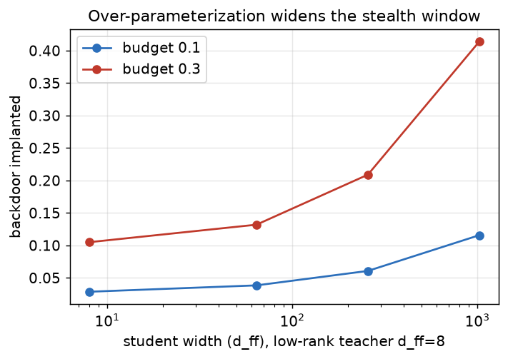

# freivalds-pol

[](https://github.com/oscartiz/freivalds-pol/actions/workflows/ci.yml)


**Cheap, sound verification of decentralized training steps** — a research prototype aimed at
[Nous Research](https://nousresearch.com)'s [Psyche](https://psyche.network) / DisTrO network.

📄 **Research writeup with figures: [`REPORT.md`](REPORT.md)** · design & derivations:
[`docs/DESIGN.md`](docs/DESIGN.md)

> Replace Psyche's ~2× redundant recompute with **sub-1%** probabilistic spot-checks, made sound
> on heterogeneous hardware by a floating-point model, hardened against adaptive adversaries, and
> stress-tested over full runs — including the finding that **per-step verification matters most
> for the large, capacity-rich models** where loss-monitoring alone is weakest.



## Why

Psyche today verifies a node's training work by **redundant recompute-and-compare** across
participants (plus Bloom filters to confirm DisTrO results were gossiped, and health checks
for liveness). That costs roughly **2× the compute to verify 1× of work**, scales poorly,
and gives nodes no data privacy.

This project explores a cheaper verifier: catch a node that submits incorrect gradient work
at **far less than full-recompute cost**, using

- **Merkle commitments** to the step transcript (model state, data shard, RNG seed, matmul
  outputs, submitted update),
- **random challenges** over the committed matmuls, and
- **Freivalds' algorithm** to check each challenged product in `O(n²)` instead of `O(n³)`,

with a phase-2 path to a **zero-knowledge** spot-check (prove a challenged matmul is correct
without shipping full activations or revealing a private shard).

See [`docs/DESIGN.md`](docs/DESIGN.md) for the full threat model, protocol, and roadmap.

## Layout

```
src/freivalds_pol/
  freivalds.py     Freivalds' probabilistic matmul check (right + left, explicit probes)
  numerics.py      floating-point error model: O(n^2) honest-noise bound, bf16/fp16 sim
  adaptive.py      adaptive adversaries (nullspace / fixed cheats)
  training.py      a real MLP training step -> MatMulRecords (+ finite-difference grad-check)
  transformer.py   a real Llama-style block step (RMSNorm/attention/GELU) -> 8 GEMMs, grad-checked
  compressor.py    simplified (1D-tiled) update compression + per-tile verifier
  demo.py          faithful 2D-chunk DeMo (decay/2D-DCT/top-k/error feedback) + per-block verifier
  trainer.py       multi-round DeMo training loop + budget-constrained adversaries
  curvature.py     Hessian-vector products + power iteration (flat/steep loss directions)
  model.py         multi-layer/multi-head transformer + AdamW (for scaling §8/§9)
  collusion.py     free-riding / update-copying detection + identity binding
  zk.py            non-interactive sumcheck argument for one matmul + PCS interface
  commitments.py   SHA-256 Merkle tree over transcript leaves
  transcript.py    StepTranscript / MatMulRecord (carries claimed dtype) + commitment
  challenge.py     random challenge sampling + Fiat-Shamir (commitment-derived) probes
  verifier.py      verify_step: commitment + shard + two-sided calibrated Freivalds + min-precision
  adversary.py     cheat transforms (lazy / wrong_compute / poison_shard)
experiments/
  run_detection.py detection rate vs #challenges; verifier cost vs recompute
  fp_crux.py       precision vs noise floor and the size of an undetectable cheat
  adaptive.py      predictable vs commit-then-sample probe; grinding; two-sided fix
  real_step.py     full verifier on a real, gradient-checked transformer-block step
  compressed.py    verify the DeMo-compressed update (DisTrO wire format) on a real gradient
  multiround.py    do sub-threshold cheats accumulate over a training run? (the hard one)
  curvature_attack.py  worst-case: aim the sub-threshold bias at the flattest loss direction
  backdoor.py      targeted backdoor: can a cheat evade per-step AND loss detection at once?
  backdoor_capacity.py  does over-parameterization open a stealthy backdoor? (yes)
  scale.py         re-run §8/§9 on a deep model + AdamW (do the findings survive?)
  grinding.py      expected work to grind an evading Fiat-Shamir probe vs cheat size
  zk_matmul.py     ZK sumcheck proof for one GEMM + honest cost vs recompute/Freivalds
  figures.py       regenerate every figure in figures/
tests/             10 pytest files (55 tests) across every module
docs/DESIGN.md     12-section design document; REPORT.md     research writeup with figures
figures/           generated plots; Makefile     test / lint / figures / experiments targets
```

## Quickstart

```bash
cd freivalds-pol
python -m venv .venv && source .venv/bin/activate
pip install -e ".[dev,viz]"

make test            # 55 tests
make lint            # ruff, clean
make figures         # regenerate figures/*.png
make experiments     # run all 9 experiment scripts

# or individually:
python -m experiments.run_detection      # detection rate / verifier cost
python -m experiments.fp_crux            # precision vs. noise floor & undetectable cheat
python -m experiments.adaptive           # predictable vs. commit-then-sample probe
python -m experiments.real_step          # full verifier on a real transformer-block step
python -m experiments.compressed         # verify the DeMo-compressed update (DisTrO format)
python -m experiments.multiround         # do sub-threshold cheats accumulate over a run?
python -m experiments.curvature_attack   # worst case: bias along the flattest loss direction
python -m experiments.backdoor           # targeted backdoor: stealth-vs-harm tradeoff
python -m experiments.backdoor_capacity  # over-parameterization widens the stealth window
python -m experiments.scale              # deep model + AdamW: do §8/§9 findings survive?
python -m experiments.grinding           # grinding cost vs cheat magnitude and rounds
python -m experiments.zk_matmul          # ZK sumcheck proof for one GEMM + honest costs
```

## Status

Working prototype, end-to-end on a **real (gradient-checked) transformer-block step** — a
Llama-style pre-norm block (RMSNorm, single-head causal attention, GELU MLP), not just
synthetic matmuls. `verify_step` runs the full protocol over all 8 GEMMs of the step
(including the data-dependent `QKᵀ` and `PV`): commitment + shard-root checks, Fiat-Shamir
(commitment-derived) probes, a two-sided Freivalds check against the calibrated FP threshold,
and a minimum-precision gate. Honest steps pass; lazy / wrong-compute / poison-shard /
post-commitment-edit / below-precision cheats are rejected. And the **DisTrO wire format** —
the DeMo-compressed update (momentum + per-tile DCT + top-k + error feedback) — is verified
per tile on that real gradient. A multi-round DeMo trainer then settles the hardest question
(do never-detected sub-threshold cheats accumulate? — no, not linearly; a worst-case
curvature-targeted adversary gains no edge; and a targeted backdoor has no stealthy-and-effective
regime at toy scale — but with **AdamW + depth the backdoor becomes loss-stealthy**, so loss
monitoring alone fails and per-step verification is *necessary*; §8 findings hold at scale). 64 tests pass.

Findings folded in:

- **FP crux** — a rigorous honest-noise bound computable in **O(n²)**, usable only at
  **≥ fp32** on the challenged layer; a statistical threshold whose smallest detectable cheat
  scales with the unit roundoff. (`experiments/fp_crux.py`, `docs/DESIGN.md` §5.)
- **Adaptive adversary** — a predictable probe is a total break (rank-1 nullspace cheat,
  unbounded impact); fixed by commit-then-sample; under fresh probes adaptivity buys nothing
  beyond the FP band and grinding is infeasible. The residual rank-1 edge is **closed by
  two-sided probing** (one-sided 0.000 → two-sided 1.000). (`experiments/adaptive.py`, §6.)
- **Compressed update** — the DeMo wire format decomposes into an elementwise momentum step, a
  *linear* DCT (Freivalds-checkable), and a top-k recompute, all checkable **per tile**; each
  compression cheat is caught with detection `1-(1-f)^c`. (`experiments/compressed.py`, §7.)
- **Multi-round (the hard one)** — over a full run, a never-detected *sub-threshold* cheat does
  **not** accumulate linearly: drift grows sublinearly (p≈0.27 vs naive p=1) and the loss is
  barely moved, because the optimizer's restoring force bounds it. A *directed* bias has a real
  (but still sublinear) edge over random noise. (`experiments/multiround.py`, §8.)
- **Worst-case curvature attack — no edge** — aiming the bias at the Hessian's flattest direction
  (via Hessian-vector products + power iteration), even re-tracked as it moves, gives no drift or
  test-loss advantage over random. Flat directions are flat because the loss ignores them.
  (`experiments/curvature_attack.py`, §8.) **Both this and the sublinear-drift finding hold at
  scale** (4-layer/8-head + AdamW, `experiments/scale.py`).
- **Targeted backdoor — loss-stealthy at scale (the M1 finding)** — with the toy SGD step a
  backdoor wrecks the loss before it implants (no stealthy regime). But with **AdamW + depth** it
  becomes *loss-stealthy*: ~98% implanted at <1.1× test loss, so **loss monitoring misses it** —
  overturning the earlier single-block claim. Every effective budget is still ≫ the per-step
  Freivalds floor, so **per-step verification catches it: it is necessary, not optional**.
  (`experiments/backdoor.py`, `experiments/scale.py`, §9 / §9b.)

**Next:** nanoGPT scale + a language objective; fuse the gradient + compression checks over a
committed accumulator chain across rounds; reproduce the AdamW backdoor on a richer objective.

## Prior art

- zkFL — gradient aggregation for federated learning · <https://arxiv.org/pdf/2502.18535>
- A Survey of ZK-Proof-Based Verifiable ML · <https://arxiv.org/html/2502.18535v2>
- VeriLLM — publicly verifiable decentralized inference · <https://arxiv.org/pdf/2509.24257>
- Psyche network architecture · <https://nousresearch.com/nous-psyche>
