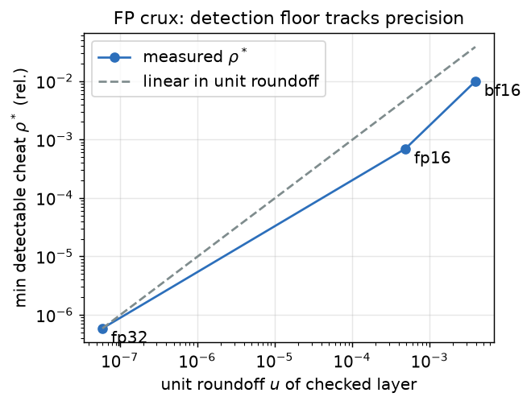
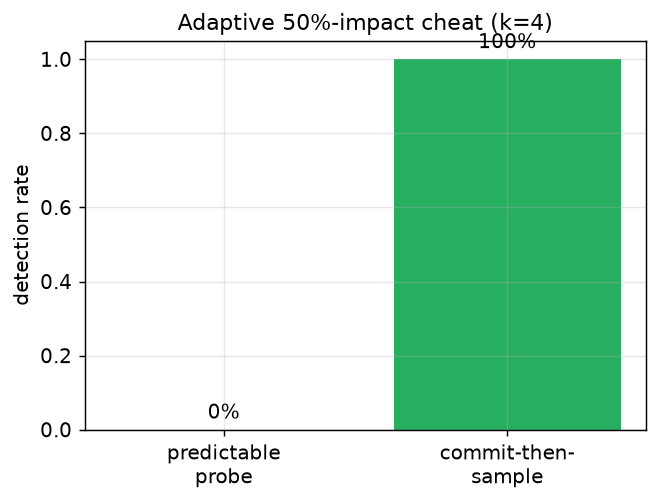
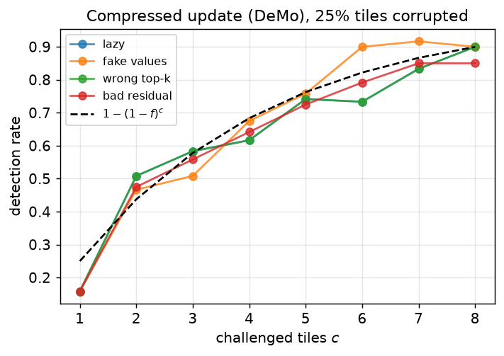
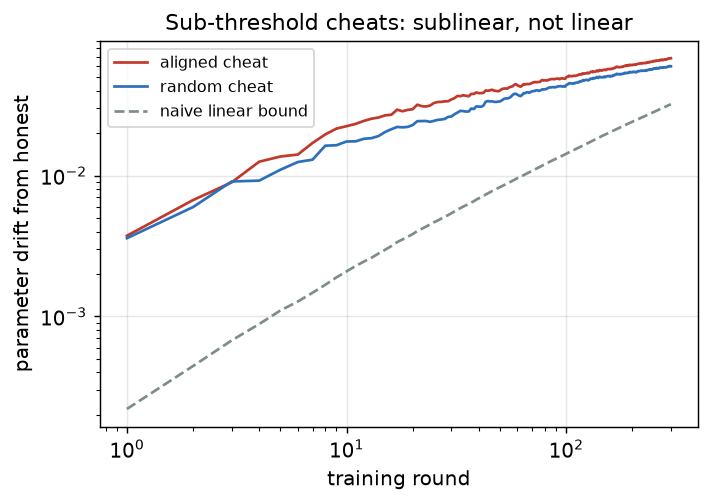
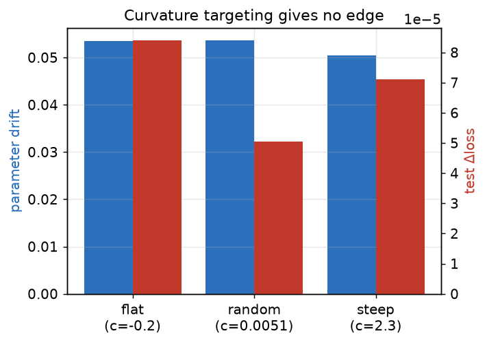
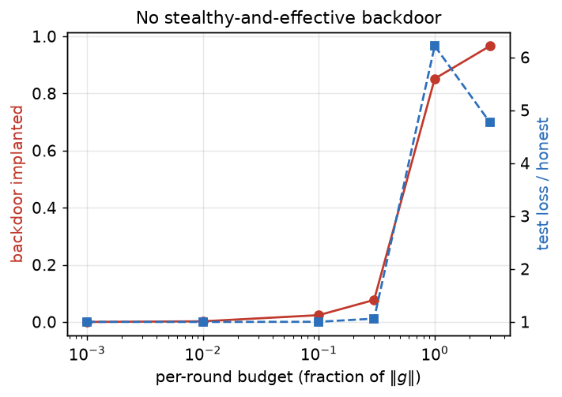
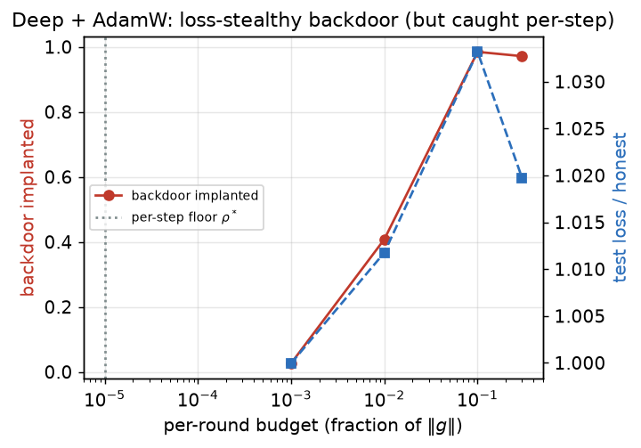

# Cheap Verification of Decentralized Training Steps

**A probabilistic + optimistic scheme for Nous Research's Psyche / DisTrO, with a
floating-point, adaptive-adversary, and multi-round security analysis.**

*Oscar Tiznado — CIMAT. Research prototype (`freivalds-pol`).*

---

## Abstract

Decentralized training networks such as [Nous Research](https://nousresearch.com)'s
[Psyche](https://psyche.network) reward untrusted nodes for gradient work, creating an incentive
to cheat; Psyche verifies via **redundant recompute-and-compare** (~2× cost). We design, build,
and measure a cheaper verifier — Merkle-committed transcripts + **Freivalds' probabilistic matmul
check** (O(n²) vs O(n³)) with a **floating-point soundness model**, **commit-then-sample**
(Fiat–Shamir) **two-sided** probes against adaptive attacks, and a **per-tile** check for the
DeMo compressed wire format — and stress-test whether it is sound for a *training run*, not just
one step.

We separate what is **validated** from what is **suggestive**. *Validated* (now up to a 4-layer,
8-head transformer trained with **AdamW**): the O(n²) check detects cheats at sub-1% of recompute
cost; the FP threshold is sound only at ≥ fp32 on the challenged layer; commit-then-sample +
two-sided probing closes the adaptive (nullspace) break; never-detected **sub-threshold cheats do
not accumulate** (drift exponent ≈0.2–0.3 vs the linear 1.0) and a **curvature-targeted**
adversary gains no edge — both confirmed at scale. The **headline, and a self-correction**: a
single-block / toy-SGD experiment suggested "no stealthy backdoor," but at scale **with a real
optimizer the backdoor becomes loss-stealthy** (~98% implanted at <1.1× test loss) — so loss
monitoring is insufficient and **per-step verification is necessary, not optional**, exactly where
it matters most. *Suggestive / scoped:* soundness is a stated bound with marked gaps (§ design
doc); the ZK spot-check is a working but non-hiding sumcheck prototype pending a polynomial
commitment; everything is numpy/CPU at ≤256 width. 80 tests, 99% coverage, CI-green, all numbers
script-backed and all figures regenerable.

---

## 1. Motivation

Psyche coordinates training on Solana and rewards nodes for gradient work computed with the
DisTrO/DeMo optimizers. Its current integrity mechanism is redundancy: results are recomputed
and compared, with Bloom filters confirming gossip and health checks for liveness. Redundancy
is expensive and offers no data privacy. The question this project answers: **can we verify a
node's training step probabilistically, for a small fraction of recompute cost, and does that
verification actually hold up over a full run against an adversary who knows the scheme?**

The angle is a natural fit for zero-knowledge / verifiable-computation tooling: the heavy object
(the gradient) is a chain of matrix products, and matrix products admit a classical cheap
probabilistic check.

## 2. Threat model

- **Coordinator** (Solana): public, semi-trusted; orders rounds, apportions data shards + seeds.
- **Nodes**: untrusted, mostly rational, some Byzantine.
- **Cheats:** (a) lazy — never did the work; (b) wrong-compute — plausible but wrong; (c)
  free-ride — copy a peer; (d) poison — train on the wrong shard; and the adaptive/long-run
  variants studied in §6–§9.
- **Goal:** catch a cheater with probability ≥ 1−ε at verifier cost ≪ recompute, honest nodes
  paying only small overhead.

## 3. The scheme

A step is recorded as a transcript of its matmuls (the GEMMs of the forward + backward pass),
plus bindings (model-state root, shard root, per-node seed, submitted update), all committed by
a Merkle root. The verifier challenges a random subset and, per challenged matmul `C = A·B`:

1. **Freivalds' check** — verify `A(Br) = Cr` for a random probe `r`: O(n²), not O(n³).
2. **Calibrated threshold** — accept iff the residual is within a bound derived from a
   floating-point error model (§4.2), so honest heterogeneous-hardware drift is not flagged.
3. **Commit-then-sample, two-sided** — the probe is derived from the commitment + a public
   beacon (Fiat–Shamir), and checked on both sides, defeating adaptive probe-targeting (§4.3).

The DisTrO **compressed** update (momentum + DCT + top-k + error feedback) is verified per tile
(§4.4). Soundness everywhere follows the spot-check law: corrupting a fraction `f` escapes a
`k`-challenge audit with probability `(1−f)^k`.

## 4. Results

All results use a real two-layer transformer block (RMSNorm, single-head causal attention, GELU
MLP) whose backprop is validated against finite differences (max rel. err ~9e-7), so the
matmuls being verified are a genuinely correct step.

### 4.1 Gradient verification: cheap and sound

Detection of a wrong-compute cheat follows `1−(1−f)^k`; at `k=8` challenges the verifier does
**~0.5% of recompute work**. Lazy / poison / free-ride cheats are caught at `k=1`. This is the
core efficiency claim: probabilistic verification replaces 2× redundancy with sub-1% spot-checks.

### 4.2 The floating-point crux

On heterogeneous hardware an honest `C ≠ A·B` exactly, so the threshold needs a numerical model:
`C = A·B + E`, `|E| ≤ γ·(|A||B|)`. The worst-case residual bound `γ·‖|A||B|‖∞` is computable in
**O(n²)** (two matvecs), preserving Freivalds' advantage. Measured: the bound is usable (sits
below the signal) only at **≥ fp32** precision on the checked layer; at bf16 it exceeds the
signal and catches nothing. A statistical threshold is tighter, and its smallest detectable
cheat `ρ*` **scales linearly with the unit roundoff** across five orders of magnitude — so
precision on the challenged layer is the security knob.



### 4.3 Adaptive adversary

If the probe is predictable, a rank-1 cheat in its nullspace evades with certainty at unbounded
impact — Freivalds is then worthless. Deriving the probe from the commitment + a fresh beacon
(**commit-then-sample**) fixes it: the same 50%-impact cheat goes from **0% to 100% detection**.
A residual rank-1 edge is closed by **two-sided** probing (one-sided 0.000 → two-sided 1.000),
and grinding the commitment for a favorable probe is infeasible for any meaningful cheat.



### 4.4 The compressed update (DisTrO wire format)

A node transmits not the dense gradient but a DeMo-compressed update (~12.5% of the data here).
It decomposes into an elementwise momentum step (O(n) recompute), a **linear DCT** (matmul check,
Freivalds-amenable), and a **top-k** selection (cheap per-tile DCT recompute). Verifying per tile,
each cheat — lazy / fake-values / wrong-top-k / bad-residual — is caught with the spot-check law,
while the verifier inspects a tiny fraction of tiles.



`compressor.py` is a simplified 1D-tiled instance; `demo.py` follows reference DeMo (2D-chunk
DCT, decay-0.999 error feedback, top-k) with conformance tests against hand-computed known
vectors. The per-block verifier is unchanged because it works for any orthonormal transform, and
DeMo's sign-quantization happens at *aggregation*, not in a node's payload — so node-level
verification is faithful. Exact deltas vs the reference are tabulated in `docs/DESIGN.md` §7b.

### 4.5 Multi-round: do sub-threshold cheats accumulate?

A node that cheats just under the threshold every round is never caught. The naive fear is
linear accumulation via error feedback. Measured over a real run: parameter drift grows
**sublinearly** (exponent ≈0.27 vs the linear bound's 1.0) and the loss is barely moved — the
optimizer's restoring force settles a sub-threshold bias at a bounded equilibrium. A *directed*
bias does have a real (but still sublinear) edge over random noise.



### 4.6 Curvature-targeted worst case

The natural worst case aims the bias at the loss Hessian's **flattest** direction (weakest
restoring force), found via Hessian-vector products + power iteration. It gives **no edge**:
curvature spans ~4 orders of magnitude while drift varies <10% and test-loss harm stays
negligible, even when the flat direction is re-tracked as it moves. Flat directions are flat
*because the loss ignores them* — so the accumulation lands where it does no functional harm.



**Validated at scale (M1).** Both §4.5 and §4.6 were re-run on a multi-layer (4), multi-head (8)
transformer trained with **AdamW** (`experiments/scale.py`) and both survive: drift exponent
p≈0.21/0.28 (still ≪ 1), and the curvature attack's drift varies only 1.09× across curvature
spanning −0.59 → +98. So the sub-threshold *accumulation* harmlessness is not an artifact of the
toy optimizer.

### 4.7 Targeted backdoor — and where it breaks at scale

The one attack that could evade per-step detection *and* loss monitoring: implant a trigger
(normal everywhere, wrong on a chosen off-distribution input). **At matched capacity with the toy
SGD step there is no stealthy-and-effective regime** — a real backdoor needs a budget ~10⁴× the
per-step floor that also blows the population loss up several-fold; over-parameterization widens
the window somewhat (a wide student takes more backdoor per unit of loss harm).



**But with a real optimizer (AdamW) and depth, this reverses — the headline M1 finding.** On the
4-layer/8-head model fitting a low-rank teacher, AdamW efficiently follows the combined objective
and the backdoor becomes **loss-stealthy**: at budget 0.1, ~98% of the backdoor implants while the
test loss moves <1.1× (so **loss monitoring does not catch it**); the capacity trend reappears at
intermediate budget (44% vs 18% at 1e-2). This **overturns the §4.7 toy-SGD conclusion**.



Crucially, **every budget that implants anything is ≫ the per-step Freivalds floor `ρ*~1e-5`**, so
the per-step check still catches it. The net is the *strongest* case for the scheme: in the
realistic regime **loss monitoring is insufficient and per-step verification is necessary, not
optional** — it carries the security the loss metric cannot, exactly for the large, capacity-rich
models Psyche targets.

## 5. Threats to validity

Per major result, the most likely reason it could be wrong:

- **Cheap detection (§4.1).** Detection follows `1−(1−f)^k` *given* the probe is unpredictable
  and the threshold is calibrated; a predictable probe or a too-loose threshold breaks it (both
  addressed in §4.2–4.3). The cost ratio assumes the gradient GEMMs dominate; tiny layers blur it.
- **FP threshold (§4.2).** The O(n²) bound is a *worst-case* deterministic bound only at ≥ fp32;
  at bf16 it is statistical and the soundness guarantee is heuristic. Cross-hardware drift larger
  than modeled (exotic accumulation orders) could raise the floor.
- **Adaptive defense (§4.3).** Soundness rests on the beacon being unbiasable and on SHA-256
  preimage resistance; a biased beacon or a grinding budget beyond §10.3's `1/q_k` wall would
  weaken it. The two-sided bound is argued, not fully proven (§10.2 gaps).
- **Compressed update (§4.4).** Faithful to DeMo's *payload* but not bit-identical (DESIGN §7b);
  the sign-quantization is assumed to be a public aggregation step (true in the reference code).
- **Sub-threshold accumulation & curvature (§4.5–4.6).** Confirmed at 4 layers / AdamW, but the
  drift exponent and "no curvature edge" are empirical over finite runs (R≤300) and could differ
  far from convergence, at much larger depth, or under a learning-rate schedule.
- **Backdoor (§4.7).** The alarming AdamW result uses *one* trigger/target and an MSE objective;
  a language objective, multiple triggers, or different optimizers might shift the implant/loss
  trade-off. The per-step-detectability claim assumes the corrupted GEMM is among those challenged.

## 5b. Limitations / open

- Validated up to a 4-layer / 8-head transformer with AdamW, numpy/CPU, ≤256 width; not yet at
  nanoGPT scale or on a language objective.
- The ZK spot-check is **prototyped, not complete**: a sound non-interactive sumcheck argument
  for one GEMM works end-to-end (`zk.py`), but the hiding/succinct opening needs a real polynomial
  commitment (KZG/FRI) — interface present, implementation future work (§11).
- Soundness (§10.2) is a stated bound with marked gaps (tight Littlewood–Offord constant; bf16).
- Fusing the gradient (Freivalds) and compression (per-tile) checks into one verifier over a
  committed accumulator chain across rounds is designed but not implemented.

## 6. Related work

Freivalds' algorithm (1977); Proof-of-Learning (Jia et al.) and its spoofing attacks (Fang et
al.); zkFL gradient aggregation; the ZK-verifiable-ML survey; VeriLLM (verifiable decentralized
*inference*). The niche — cheap, FP-sound, adaptive-and-multi-round-tested verification of
*training* steps for real decentralized runs — is largely open.

## 7. Reproducibility

```bash
pip install -e ".[dev,viz]"
make test            # 80 tests
make coverage        # ~99% line coverage on the library
make figures         # regenerate every figure in figures/
make experiments     # rerun every experiment script
```

Every number above comes from a script under `experiments/`; every figure from
`experiments/figures.py`. Design details and derivations are in [`docs/DESIGN.md`](docs/DESIGN.md).

**Determinism.** Every experiment seeds its NumPy `Generator` explicitly (e.g.
`default_rng(0)`), and every Monte-Carlo inner loop is seeded by its iteration index, so a run
reproduces exactly on a fixed environment. *Caveat:* bit-for-bit identical figures across
machines also require the same NumPy/BLAS build and thread count, because BLAS may reorder
floating-point matmul accumulation; set `OMP_NUM_THREADS=1` for the strictest reproducibility.
The qualitative results (detection rates, drift exponents, the capacity trend) are stable across
environments. Reference environment for the numbers and figures here: Python 3.14, NumPy 2.x,
single-threaded BLAS, CPU.

**Test coverage.** 80 tests, ~**99%** line coverage of `src/freivalds_pol` (`make coverage`).
CI (`.github/workflows/ci.yml`) runs ruff + pytest on Python 3.10 and 3.12 on every push.

## 8. Conclusion

Probabilistic verification can replace redundant recompute for decentralized training at sub-1%
cost — *if* the threshold is grounded in a floating-point model (≥ fp32 on the challenged layer)
and the probe is committed before it is revealed. The scheme's *accumulation* safety (sub-threshold
cheats stay sublinear; curvature targeting gains no edge) **holds up to a 4-layer / 8-head model
trained with AdamW**. Its sharpest result is a self-correction: a toy-SGD experiment suggested
backdoors are un-stealthy, but **with a real optimizer the backdoor becomes loss-stealthy**, so
loss monitoring is insufficient and per-step verification is *necessary* — strongest exactly for
the large models Psyche targets. What remains open is honestly bounded: a complete proof, a real
polynomial-commitment ZK opening, and nanoGPT/language-objective scale. Five of the project's own
hypotheses were overturned by its own measurements; each correction sharpened the result and is
recorded in [`CHANGES.md`](CHANGES.md).
